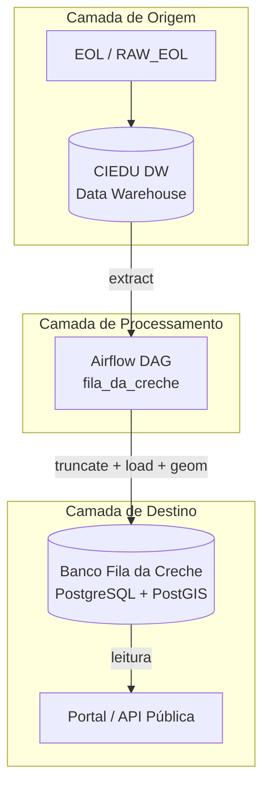
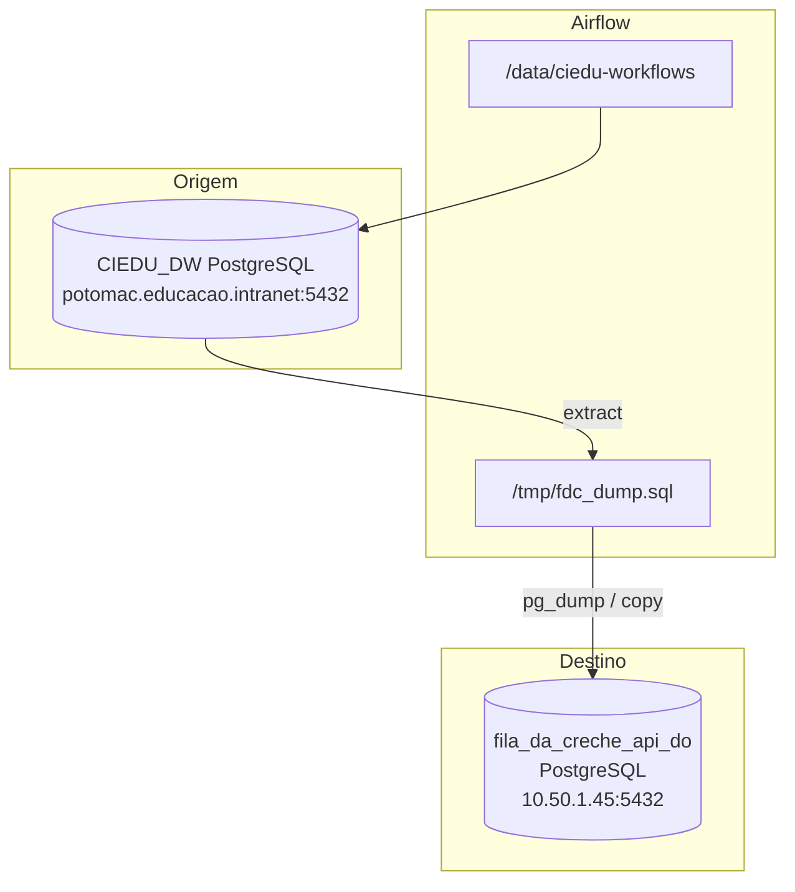
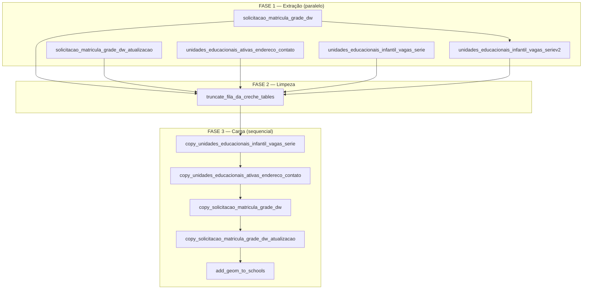

# Documento de Arquitetura Técnica

## DAG Airflow – `fila_da_creche`

## 1. Visão Executiva

A DAG **fila_da_creche** é responsável pela preparação, consolidação e publicação diária dos dados utilizados pela aplicação pública da Fila da Creche.

A solução extrai informações consolidadas do Data Warehouse Educacional (CIEDU_DW), gera tabelas analíticas relacionadas à fila de matrícula infantil, replica os dados para o banco da aplicação e realiza um pós-processamento geográfico para enriquecimento das informações das unidades escolares.

## 2. Objetivo de Negócio

Disponibilizar à aplicação da Fila da Creche informações atualizadas sobre:

- Solicitações de matrícula
- Lista de espera
- Unidades Educacionais
- Endereços e contatos
- Disponibilidade de vagas
- Geolocalização das escolas

O processo realiza anonimização dos identificadores das solicitações antes da exposição pública dos dados.

## 3. Informações Gerais da DAG

- DAG ID: fila_da_creche
- Arquivo: fila_da_creche.py
- Agendamento: Diário às 10h
- Owner: airflow
- Retries: 2
- Catchup: True
- Concurrency: 16
- Max Active Runs: 16
- Quantidade de Tasks: 11
- Timezone: America/Sao_Paulo


## 4. Arquitetura Lógica




## 5. Arquitetura Física



**Objetivo**

- Construir fatos e dimensões
- Consolidar
- Preparar informação para divulgação pública


## 6. Fluxo de Processamento


### Construção DW

- solicitacao_matricula_grade_dw
- solicitacao_matricula_grade_dw_atualizacao
- unidades_educacionais_ativas_endereco_contato
- unidades_educacionais_infantil_vagas_serie
- unidades_educacionais_infantil_vagas_seriev2


### Preparação Destino

- truncate_fila_da_creche_tables

Objetivo : Limpar completamente as tabelas do banco da aplicação.

### Replicação

- copy_unidades_educacionais_infantil_vagas_serie
- copy_unidades_educacionais_ativas_endereco_contato
- copy_solicitacao_matricula_grade_dw
- copy_solicitacao_matricula_grade_dw_atualizacao

Objetivo: a DAG carrega dados da origem e recarrega no banco da aplicação

### Georreferenciamento

- add_geom_to_schools

Objetivo:  

a - Adicionar geometricas das escolas 

b - Suportar consultas espaciais 

c - Possibiltar visualizações em mapas

## 7. Fluxo da DAG




### Saúde operacional (histórico)


| Métrica                         | Valor                                  |
| ------------------------------- | -------------------------------------- |
| Sucesso                         | ~31.274 execuções                      |
| Falha                           | ~156                                   |
| Upstream failed                 | ~854                                   |
| Duração média                   | ~1 min 03 s (min 58 s, max 1 min 25 s) |
| Últimas 25 runs (maio–jun/2026) | 100% sucesso                           |


**Tasks mais lentas:** `unidades_educacionais_infantil_vagas_serie` e variantes (~15–50 s). Demais tasks < 5 s.

## 8. Regras de Negócio

- Origem Cadastro: tp_origem = 'C'
- Status ativo: st_solicitacao_atual = 'S'
- Espera superior a 30 dias
- Distância máxima de 2 km
- Anonimização dos identificadores


## 9. Dependências


### Conexões

- ciedu_dw
- fila_da_creche_api_do


### Variáveis

- REPO_PATH
- CIEDU_DW_URI
- FILA_DA_CRECHE_DB_URI
- EXPORT_PATH


## 10. Riscos

- Estratégia Full Refresh (truncate + reload)
- Ausência aparente de rollback
- Uso de arquivo temporário compartilhado
- Dependência do banco de destino
- Dependência de variáveis Airflow


## 11. Recomendações


### Curto Prazo

- Validar volume pós-carga
- Criar alertas automáticos
- Monitorar integridade dos dados


### Médio Prazo

- Migrar para carga incremental
- Eliminar dependência de arquivo temporário
- Melhorar observabilidade


### Longo Prazo

- CDC
- Data Quality automatizada
- Replicação contínua


## 12. Modelo Draw.io

Arquivos gerados em `diagramas/drawio/fila-da-creche/` — abrir em [app.diagrams.net](https://app.diagrams.net) ou Draw.io Desktop:

| Arquivo | Seção do documento |
|---|---|
| `01-arquitetura-logica.drawio` | §4 — Arquitetura Lógica |
| `02-arquitetura-fisica.drawio` | §5 — Arquitetura Física |
| `03-fluxo-processamento.drawio` | §6 — Fluxo de Processamento (4 fases) |
| `04-fluxo-dag.drawio` | §7 — Fluxo da DAG (11 tasks) |
| `05-modelo-completo.drawio` | §12 — Modelo completo do pipeline |
| `06-riscos-recomendacoes.drawio` | §10–11 — Riscos e Recomendações |

**Exportar:** File → Export as → PNG / SVG / PDF

```text
[EOL / RAW]
      |
      v
[CIEDU DW]
      |
      v
[Airflow DAG]
      |
      v
[Transformações]
      |
      v
[Truncate Destino]
      |
      v
[Replicação pg_dump]
      |
      v
[Fila da Creche DB]
      |
      v
[Add Geom]
      |
      v
[Portal Público]
```

