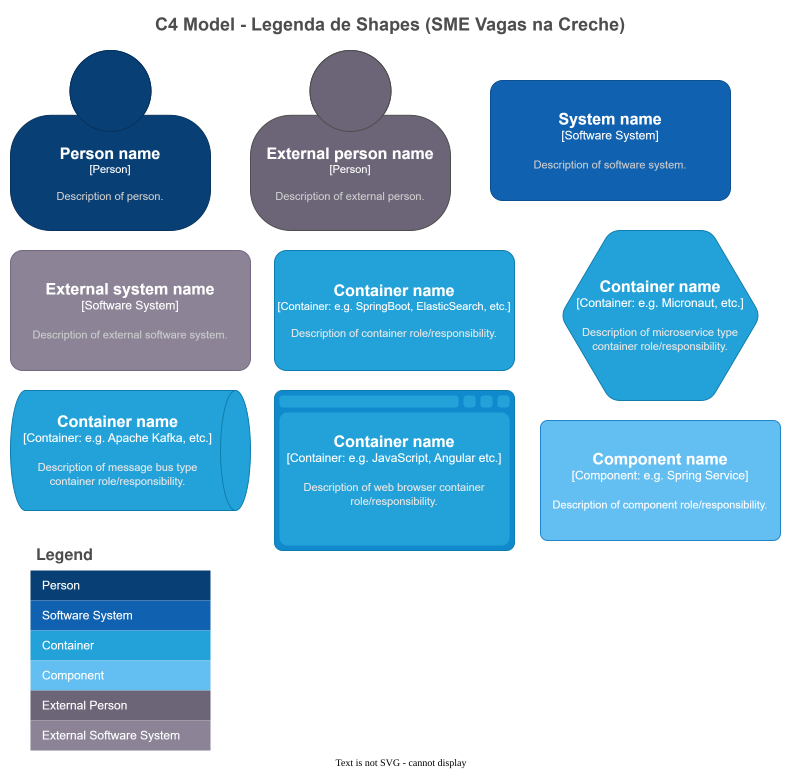

# Assets (SVG / Draw.io)

Arquivos visuais exportados e editáveis do modelo C4 do Vagas na Creche.

```{toctree}
:maxdepth: 1
```

| Arquivo | Conteúdo |
|---------|----------|
| `01-c4-legenda.svg` | Legenda C4 |
| `02-airflow-contexto.svg` | Contexto sistema + Airflow |
| `03-airflow-dag.svg` | DAG `fila_da_creche` |
| `04-airflow-etl.svg` | Fluxo ETL diário |
| `05-sistema-arquitetura.svg` | Diagrama de containers |
| `06-sistema-matriz-risco.svg` | Matriz de risco |
| `07-sistema-cicd.svg` | Pipeline CI/CD |
| `08-sistema-avaliacao.svg` | Avaliação consolidada |
| `09-negocio-jornadas.svg` | Jornadas do cidadão |
| `ARQUITETURA - VAGA NA CRECHE - C4.drawio` | Fonte editável (diagrams.net) |

## Legenda C4



## Contexto sistema + Airflow


## DAG fila_da_creche


## Fluxo ETL diário


## Diagrama de containers


## Matriz de risco


## Pipeline CI/CD


## Avaliação consolidada


## Jornadas do cidadão


