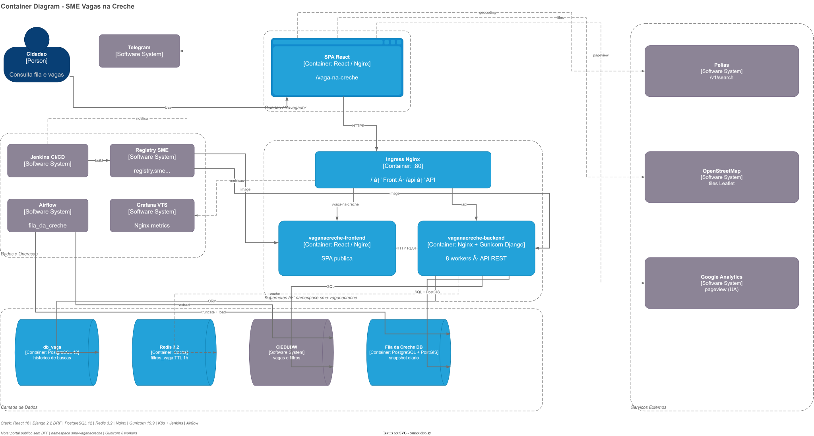

# Componente: SME-VagasNaCreche-FrontEnd

O **SME-VagasNaCreche-FrontEnd** é a SPA pública do cidadão. Organiza rotas, busca de fila, vagas remanescentes e mapa, consumindo a API Vagas na Creche e a API Pelias — **sem BFF**.

---

## 1. Visão geral da arquitetura (C3)

Componentes de UI por feature + camada fina de serviços HTTP (Axios). Estado cross-feature via **pubsub-js** e `localStorage`.

---

## 2. Descrição dos componentes e responsabilidades

### 2.1 Shell e rotas

| Componente | Responsabilidade |
|------------|------------------|
| **App / Routes** | Rotas da SPA sob `/vaga-na-creche` (fila, vagas remanescentes, manutenção) |
| **MenuPrincipal** | Navegação entre jornadas; PubSub para sincronização com mapa/tabela |
| **Preferências** | Série, endereço, coordenadas e acessibilidade em `localStorage` |

### 2.2 Domínio de fila e mapa

| Componente | Responsabilidade |
|------------|------------------|
| **Creches** | Orquestra endereço, data de nascimento, série e chamada à API de fila |
| **Mapa (Leaflet)** | Marcadores/popups; tiles OpenStreetMap; updates via PubSub |
| **Tabela de resultados** | Lista escolas + posição na fila |

### 2.3 Vagas remanescentes

| Componente | Responsabilidade |
|------------|------------------|
| **Fluxo vagas remanescentes** | Seleção de série/categoria e filtros territoriais |
| **Filtros** | Consome `/vaga/filtros/` (DRE, distrito, subprefeitura) |
| **Resultado** | Tabela + mapa com escolas que possuem vaga |

### 2.4 Serviços (borda HTTP)

| Módulo | Destino |
|--------|---------|
| **ConectarApi.js** | Wrapper Axios — API Vagas na Creche (`API_URL`) |
| **Geocodificação** | Pelias (`API_ENDERECO` + `/v1/search`) |
| **Analytics** | Google Analytics (UA — pageview inicial) |

### 2.5 Estado e configuração

* **pubsub-js:** comunicação mapa ↔ tabela ↔ menu (risco de memory leak sem unsubscribe)
* **localStorage:** preferências de busca entre páginas
* **entrypoint.sh:** injeta `API_URL`, `API_ENDERECO`, `URL_VIDEO` em runtime

---

## 3. Diretrizes para o desenvolvedor

1. **Não acoplar o Front ao DW/banco:** toda consulta de domínio via API Vagas na Creche.
2. **Tratar erros de API:** evitar `.catch()` vazios; feedback visível ao cidadão.
3. **PubSub:** sempre fazer unsubscribe no unmount para evitar memory leaks.
4. **Geocoding:** não chamar a API de fila antes de ter lat/lon válidos (corrigir race em `Creches.js`).
5. **Rotas de vagas:** unificar `/vagas-remanescentes` e `/vagas-remanescentes-alternativo`.
6. **Analytics:** planejar migração UA → GA4 com tracking de rotas da SPA.
7. **Debounce** no autocomplete de endereço para não sobrecarregar o Pelias.

---

## 4. Relação com jornadas / containers

| Tema | Referência |
|------|------------|
| Portal público / sem BFF | [container.md](../container/container.md) |
| Jornada fila | [contexto-fila.md](../contexto/contexto-fila.md) |
| Jornada vagas | [contexto-vagas.md](../contexto/contexto-vagas.md) |
| FrontEnd container | [container-frontend.md](../container/container-frontend.md) |
