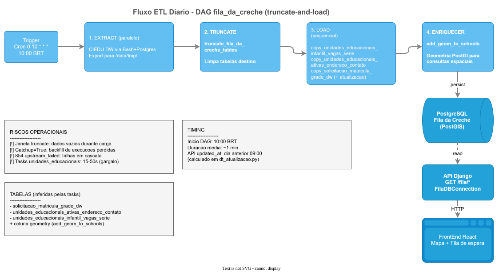
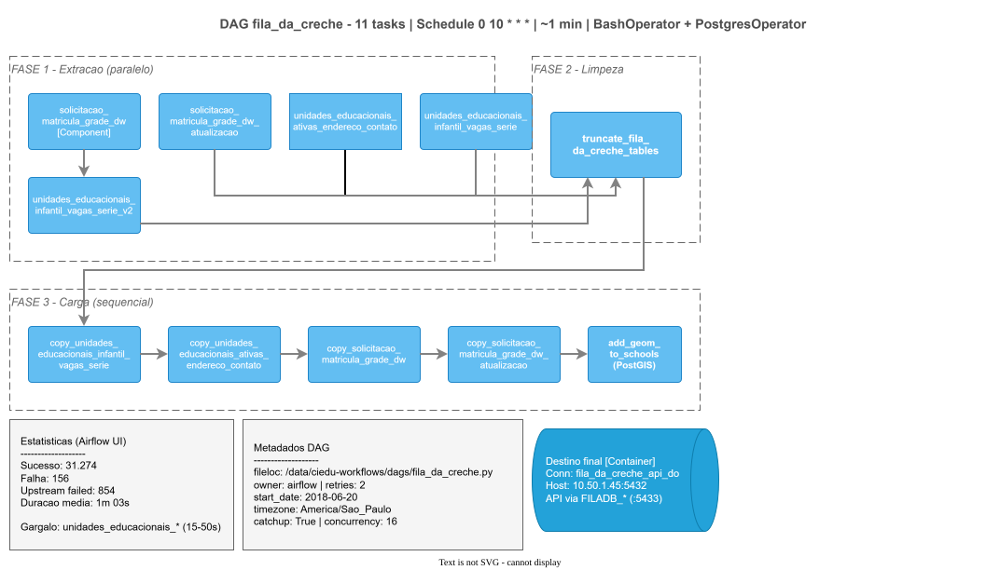

# Contexto — Carga de Dados (Airflow)

## Contexto

Os dados de **fila de espera** exibidos no portal **não** são lidos em tempo real do CIEDU DW pela API. Um pipeline **diário** no Apache Airflow extrai consolidados do DW, aplica regras de negócio e **anonimização**, e **republica** as tabelas no banco **Fila da Creche** (PostgreSQL + PostGIS), consumido pelo portal.



Também disponível o detalhamento da DAG:



---

## Objetivos

- Disponibilizar fila, unidades, contatos, vagas e geolocalização atualizados ao portal
- Isolar a API pública da carga dos sistemas transacionais (EOL)
- Publicar dados com **anonimização** de identificadores das solicitações
- Enriquecer escolas com geometria (PostGIS) para consultas por raio e mapa

---

## Escopo

| Item | Detalhe |
|------|---------|
| DAG | `fila_da_creche` |
| Schedule | Diário às **10h** (America/Sao_Paulo) |
| Origem | `ciedu_dw` (a partir de EOL / RAW) |
| Destino | Banco Fila da Creche (`fila_da_creche_api_do`) |
| Estratégia | Full refresh — truncate + reload |
| Tasks | 11 (extração → truncate → copy → `add_geom_to_schools`) |

### Regras de negócio na carga

- Origem cadastro: `tp_origem = 'C'`
- Status ativo: `st_solicitacao_atual = 'S'`
- Espera superior a 30 dias
- Distância máxima de 2 km
- Anonimização dos identificadores

### Fora de escopo deste contexto

- CDC / carga incremental (evolução proposta)
- Carga das **vagas remanescentes** (consultadas direto no CIEDUDW pela API)
- Escrita no banco aplicacional `db_vaga` (telemetria é feita pela API)

---

## Fluxo resumido

```text
EOL / RAW → CIEDU DW → Airflow (11 tasks) → truncate + copy + geom → Fila DB → API / Portal
```

---

## Riscos de negócio

| Risco | Impacto |
|-------|---------|
| Falha na carga diária | Portal exibe fila do dia anterior (ou dados inconsistentes) |
| Full refresh sem rollback claro | Janela com tabelas vazias durante a publicação |
| Dependência de arquivo temporário / variáveis Airflow | Fragilidade operacional |
| Host/destino divergente | API e ETL apontarem datasets diferentes |

---

## Resultado esperado

Ao final de cada execução bem-sucedida (~1 min), o portal passa a consultar o novo snapshot da fila. A data de atualização deve ser comunicada ao cidadão (recomendação de produto). Evoluções desejadas: carga incremental, validação de volume pós-carga e alertas automáticos.
