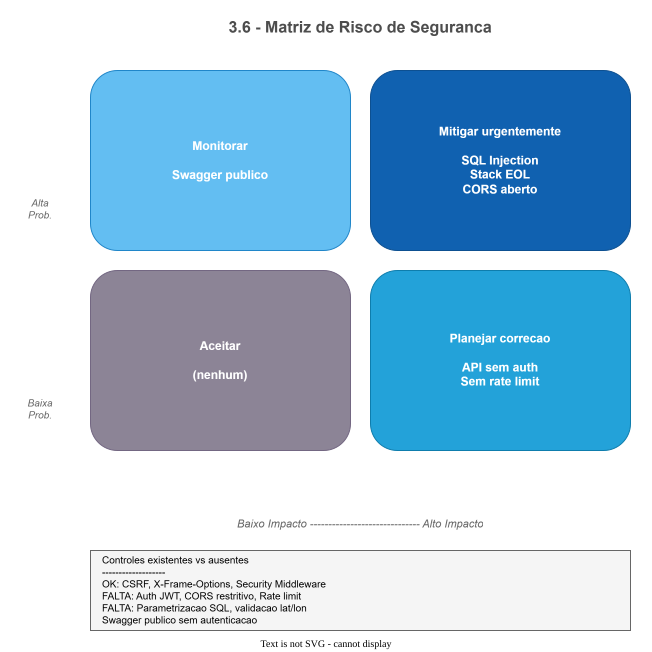
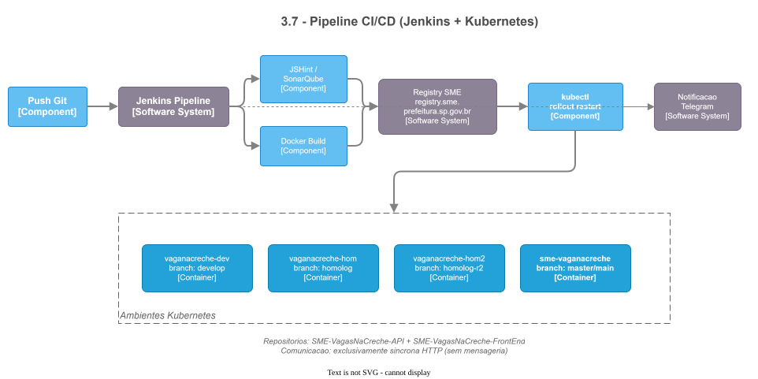
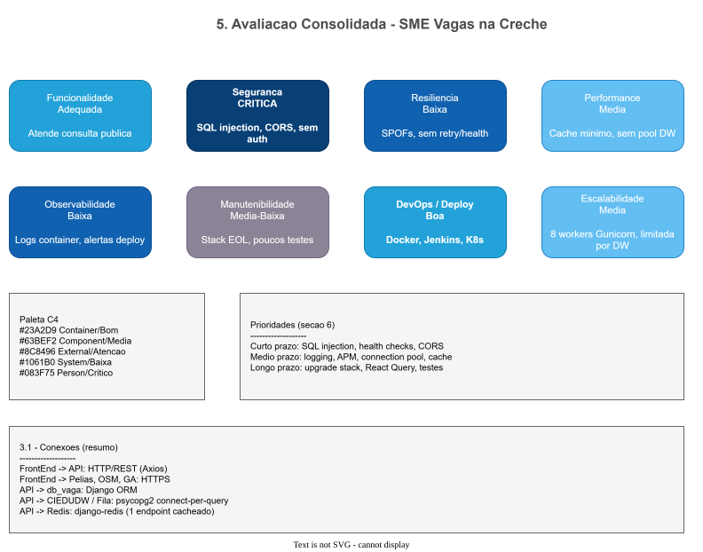

# Documentação Arquitetural — SME Vagas na Creche

**Sistema:** SME Vagas na Creche  
**Componentes analisados:** SME-VagasNaCreche-API · SME-VagasNaCreche-FrontEnd  
**Data da análise:** Julho/2026  
**Versão do documento:** 1.0  
**Público-alvo:** Apresentação ao cliente / stakeholders técnicos e de negócio

---

## 1. Visão Geral do Sistema

O **SME Vagas na Creche** é um portal público da Secretaria Municipal de Educação de São Paulo que permite aos cidadãos:

- Consultar a **demanda (fila de espera)** por vagas em creches próximas a um endereço informado.
- Consultar **vagas remanescentes** disponíveis, filtrando por DRE, distrito ou subprefeitura.
- Visualizar escolas em um **mapa interativo** (Leaflet / OpenStreetMap).
- Registrar histórico de buscas por endereço (telemetria de uso).

A solução é composta por dois repositórios independentes, implantados em **Kubernetes** na infraestrutura da SME, com pipeline **CI/CD via Jenkins**.

| Componente                             | Tecnologia principal               | Função                                            |
| -------------------------------------- | ---------------------------------- | ------------------------------------------------- |
| **FrontEnd**                           | React 16 + Create React App 3      | SPA pública servida por Nginx                     |
| **API**                                | Django 2.2 + Django REST Framework | API REST de consulta e persistência               |
| **Banco aplicacional (**`db_vaga`**)** | PostgreSQL 12                      | Dados próprios da aplicação (histórico de buscas) |
| **Data Warehouse**                     | PostgreSQL (CIEDUDW)               | Dados de vagas, DREs, distritos                   |
| **Banco da Fila**                      | PostgreSQL + PostGIS (porta 5433)  | Dados de fila de espera e geolocalização          |
| **Cache**                              | Redis 3.2                          | Cache de filtros de vagas remanescentes           |

---

## 2. Diagrama de Arquitetura

---

## 3. Respostas às Questões Solicitadas

### 3.1 — Qual tipo de conexão?

#### FrontEnd → Backends

| Origem    | Destino            | Protocolo             | Descrição                          |
| --------- | ------------------ | --------------------- | ---------------------------------- |
| SPA React | API Vaga na Creche | **HTTP/REST** (Axios) | Consultas de fila, vagas e filtros |
| SPA React | API de Endereços   | **HTTP/REST** (Axios) | Autocomplete de endereços (Pelias) |
| SPA React | OpenStreetMap      | **HTTPS**             | Tiles do mapa Leaflet              |
| SPA React | Google Analytics   | **HTTPS**             | Rastreamento de pageview           |

O cliente HTTP é centralizado em `ConectarApi.js` — um wrapper simples sobre Axios, sem interceptors, sem autenticação e sem WebSocket.

**URLs configuradas em runtime** (injeção via `entrypoint.sh` no container Docker):

- `API_URL` — base da API de vagas/creche
- `API_ENDERECO` — base da API de geocodificação
- `URL_VIDEO` — URL de vídeo institucional

#### API → Bancos de Dados

| Conexão                        | Driver / ORM                   | Padrão                         | Variáveis de ambiente                                                                |
| ------------------------------ | ------------------------------ | ------------------------------ | ------------------------------------------------------------------------------------ |
| Banco aplicacional (`db_vaga`) | Django ORM + psycopg2          | Pool gerenciado pelo Django    | `POSTGRES_DB=db_vaga`, `POSTGRES_USER`, `POSTGRES_PASSWORD`, `DB_HOST`, `DB_PORT`    |
| CIEDUDW (Data Warehouse)       | psycopg2 (SQL bruto)           | **Nova conexão TCP por query** | `CIEDUDW_HOST`, `CIEDUDW_USER`, `CIEDUDW_PASS`, `CIEDUDW_DB`                         |
| Fila da Creche                 | psycopg2 (SQL bruto + PostGIS) | **Nova conexão TCP por query** | `FILADB_HOST`, `FILADB_USER`, `FILADB_PASS` (dbname fixo: `postgres`, porta: `5433`) |
| Redis                          | django-redis                   | Cliente Redis padrão           | `REDIS_URL`                                                                          |

#### API → Cliente

| Camada       | Tecnologia                              |
| ------------ | --------------------------------------- |
| Entrada HTTP | Nginx 1.15 (reverse proxy)              |
| Aplicação    | Gunicorn 19.9 (8 workers, timeout 120s) |
| Protocolo    | HTTP síncrono request/response          |
| Documentação | Swagger UI na raiz (`/`) via drf-yasg   |

**Não há:** conexões WebSocket, gRPC, GraphQL, filas de mensageria ou integrações HTTP outbound na API.

---

### 3.2 — Utiliza cache no sistema? Qual?

**Sim, parcialmente — apenas na API, em um único endpoint.**

| Aspecto                | Detalhe                                                                                |
| ---------------------- | -------------------------------------------------------------------------------------- |
| **Tecnologia**         | Redis 3.2 via `django-redis`                                                           |
| **Endpoint cacheado**  | `GET /vaga/filtros/` (DREs, distritos, subprefeituras)                                 |
| **Chave de cache**     | `filtros_vaga` (global, não segmentada por usuário)                                    |
| **TTL**                | 3.600 segundos (1 hora)                                                                |
| **Serialização**       | `pickle` + compressão `zlib`                                                           |
| **Tolerância a falha** | `IGNORE_EXCEPTIONS: True` — se o Redis cair, a API continua sem cache, silenciosamente |

**Endpoints NÃO cacheados** (consultam bancos externos a cada requisição):

- `GET /fila/espera_escola_raio/{lat}/{lon}/{cd_serie}`
- `GET /vaga/{cd_serie}/?filtro=...&busca=...`
- `POST /pesquisa/historico_busca_end/`

#### FrontEnd

| Mecanismo                     | Uso                                                                                                |
| ----------------------------- | -------------------------------------------------------------------------------------------------- |
| **localStorage**              | Persistência de preferências de busca (série, endereço, coordenadas, acessibilidade) entre páginas |
| **React Query / SWR / Redux** | Não utilizados                                                                                     |
| **Service Worker (PWA)**      | Desabilitado (`serviceWorker.unregister()`)                                                        |
| **Cache HTTP**                | Não configurado explicitamente                                                                     |

**Conclusão:** O cache é mínimo e concentrado em dados de referência (filtros). As consultas de maior volume e impacto (fila e vagas por escola) não possuem cache.

---

### 3.3 — Pontos de falha que precisam ser melhorados

#### Críticos (ação imediata recomendada)

| #   | Ponto de falha                                                                                                                                          | Impacto                                             | Localização                                             |
| --- | ------------------------------------------------------------------------------------------------------------------------------------------------------- | --------------------------------------------------- | ------------------------------------------------------- |
| 1   | **SQL Injection** — parâmetros de URL e query string interpolados diretamente em SQL (`lat`, `lon`, `cd_serie`, `filtro`, `busca`)                      | Comprometimento de dados / indisponibilidade        | `fila_da_creche/queries/`, `vaga_remanescente/queries/` |
| 2   | **API sem autenticação** — todos os endpoints são públicos, incluindo `POST /pesquisa/historico_busca_end/` e Django Admin (`/admin/`)                  | Abuso, spam de dados, acesso administrativo         | `settings.py`, views DRF                                |
| 3   | **CORS aberto** — `CORS_ORIGIN_ALLOW_ALL = True`                                                                                                        | Qualquer origem pode consumir a API                 | `settings.py`                                           |
| 4   | **Tratamento de erro frágil em conexões externas** — em falha, retorna tupla/string `'ERROR'` em vez de estrutura esperada, causando crash (`KeyError`) | Indisponibilidade em cascata quando DW ou Fila caem | `ciedudw_connection.py`, `db_fila_creche_connection.py` |

#### Altos

| #   | Ponto de falha                                                                                                                                        | Impacto                                                |
| --- | ----------------------------------------------------------------------------------------------------------------------------------------------------- | ------------------------------------------------------ |
| 5   | **Dependência de 2 bancos externos sem fallback** — `/fila/` e `/vaga/` ficam indisponíveis se CIEDUDW ou FilaDB caírem                               | Indisponibilidade total das funcionalidades principais |
| 6   | **Sem connection pooling nos bancos externos** — nova conexão TCP por query                                                                           | Lentidão sob carga, esgotamento de conexões            |
| 7   | **Stack tecnológica EOL** — Python 3.7, Django 2.2, Node 12, React 16, axios 0.19, Redis 3.2                                                          | Vulnerabilidades conhecidas sem patches                |
| 8   | **Race condition no FrontEnd** — `Creches.js` usa `UNSAFE_componentWillMount` + `componentDidMount`; API pode ser chamada com coordenadas `undefined` | Resultado vazio ou erro intermitente                   |
| 9   | **Erros silenciados no FrontEnd** — blocos `.catch()` vazios em chamadas de API                                                                       | Falhas invisíveis ao usuário e à operação              |

#### Médios

| #   | Ponto de falha                                                                                                                           | Impacto                                             |
| --- | ---------------------------------------------------------------------------------------------------------------------------------------- | --------------------------------------------------- |
| 10  | **Sem health checks** — Kubernetes não consegue verificar saúde de dependências (DB, Redis, DW)                                          | Pods unhealthy não detectados adequadamente         |
| 11  | **Pickle no Redis** — vetor de ataque se Redis for comprometido                                                                          | Risco de desserialização maliciosa                  |
| 12  | **SECRET_KEY com fallback hardcoded** (`'xtpo'`)                                                                                         | Sessões previsíveis se variável de ambiente ausente |
| 13  | **ALLOWED_HOSTS = ['*']**                                                                                                                | Vulnerável a Host Header attacks                    |
| 14  | **PubSub sem unsubscribe** — memory leaks em `Mapa.jsx` e `MenuPrincipal.js`                                                             | Degradação de performance em sessões longas         |
| 15  | **Rota de menu inconsistente** — menu aponta para `/vagas-remanescentes` (manutenção), fluxo ativo em `/vagas-remanescentes-alternativo` | Confusão do usuário                                 |
| 16  | **Cobertura de testes mínima** — API: 1 teste (Swagger 200); FrontEnd: zero testes                                                       | Regressões não detectadas                           |
| 17  | **Autocomplete sem debounce** — cada tecla dispara chamada à API de geocodificação                                                       | Sobrecarga desnecessária                            |

---

### 3.4 — Existe padrão de observabilidade?

**Observabilidade atual: básica / insuficiente para produção crítica.**

| Capacidade                   | API                        | FrontEnd                     | Observação                                       |
| ---------------------------- | -------------------------- | ---------------------------- | ------------------------------------------------ |
| **Logging estruturado**      | Ausente                    | Ausente                      | Sem uso de módulo `logging` / Winston            |
| **APM / Monitoramento**      | Ausente                    | Ausente                      | Sem Datadog, New Relic, Prometheus, etc.         |
| **Rastreamento distribuído** | Ausente                    | Ausente                      | Sem OpenTelemetry / correlation IDs              |
| **Health checks**            | Ausente                    | N/A                          | Sem `/health`, `/ready` ou `django-health-check` |
| **Error tracking**           | Ausente                    | Ausente                      | Sem Sentry ou equivalente                        |
| **Métricas de negócio**      | Ausente                    | Parcial                      | GA pageview único no carregamento                |
| **Access/Error logs**        | Gunicorn stdout/stderr     | Nginx default                | Sem shipping centralizado no repositório         |
| **Alertas operacionais**     | Telegram (Jenkins)         | Telegram (Jenkins)           | Apenas build/deploy, não runtime                 |
| **Análise de código**        | SonarQube (branch homolog) | SonarQube + JSHint (homolog) | Qualidade estática, não runtime                  |
| **Documentação de API**      | Swagger UI (`/`)           | —                            | Documentação funcional presente                  |

**O que existe hoje:**

1. Logs de acesso e erro do Gunicorn direcionados ao stdout do container.
2. Notificações Telegram no pipeline Jenkins (sucesso/falha de build e deploy).
3. SonarQube na branch `homolog` (análise estática).
4. Google Analytics (Universal Analytics — **deprecated**, sem tracking de mudança de rota).

**Lacunas principais:**

- Impossível saber, a partir da aplicação, se CIEDUDW ou FilaDB estão saudáveis.
- Erros de API no FrontEnd são engolidos — sem visibilidade para o time de operação.
- Sem dashboards de latência, taxa de erro ou throughput.
- Sem alertas proativos de indisponibilidade em runtime.

---

### 3.5 — Utiliza padrões de projeto? Quais?

#### API (Django / DRF)

| Padrão                        | Aplicado? | Implementação                                                                   |
| ----------------------------- | --------- | ------------------------------------------------------------------------------- |
| **Arquitetura em camadas**    | Sim       | Views → Módulos `queries/` → Classes de conexão                                 |
| **Modularização por domínio** | Sim       | Apps Django: `fila_da_creche`, `vaga_remanescente`, `pesquisa`, `helloapp`      |
| **API View (DRF)**            | Sim       | `APIView` para endpoints customizados; `ModelViewSet` para histórico de busca   |
| **ORM vs SQL bruto**          | Sim       | ORM para dados próprios; SQL raw para DW e Fila                                 |
| **Service Layer**             | Parcial   | Módulos `queries/` funcionam como camada de serviço fina                        |
| **Repository**                | Não       | SQL embutido em strings, sem abstração                                          |
| **Dependency Injection**      | Não       | Conexões instanciadas diretamente (`CIEDUDWConnection()`, `FilaDBConnection()`) |
| **CQRS / Event Sourcing**     | Não       | —                                                                               |
| **Circuit Breaker / Retry**   | Não       | —                                                                               |
| **Factory / Strategy**        | Não       | —                                                                               |

**Caracterização:** Arquitetura pragmática de **thin query service** sobre data warehouses externos. Não segue DDD, Clean Architecture ou Hexagonal de forma formal.

### 3.6 — Pontos de entrada têm padrão de segurança?

#### Contexto

Trata-se de um **portal público** para cidadãos — não há login de usuário por design. Ainda assim, existem controles mínimos esperados para APIs expostas na internet.

#### API — Controles existentes

| Controle                 | Status               | Detalhe                                                                   |
| ------------------------ | -------------------- | ------------------------------------------------------------------------- |
| HTTPS / HSTS             | Parcial              | `SECURE_HSTS_SECONDS = 60` (valor muito baixo)                            |
| CSRF Middleware          | Ativo                | Pode impactar `POST /pesquisa/` sem token                                 |
| X-Frame-Options          | Ativo                | `XFrameOptionsMiddleware`                                                 |
| Security Middleware      | Ativo                | Headers básicos do Django                                                 |
| Autenticação JWT/Token   | **Não implementado** | `rest_framework.authtoken` comentado                                      |
| Autorização por endpoint | **Ausente**          | `AllowAny` no Swagger; views sem `permission_classes`                     |
| CORS restritivo          | **Não**              | `CORS_ORIGIN_ALLOW_ALL = True`                                            |
| Rate limiting            | **Ausente**          | Sem throttling DRF                                                        |
| Input validation         | **Mínima**           | `cd_serie` validado contra lista fixa; `lat`/`lon` sem validação de range |
| Parametrização SQL       | **Ausente**          | SQL injection possível                                                    |
| Swagger público          | **Sim**              | Schema completo exposto sem autenticação                                  |

#### Matriz de risco de segurança

---

### 3.7 — Utiliza mensageria?

**Não.** O sistema não utiliza mensageria assíncrona em nenhuma camada.

**Comunicação exclusivamente síncrona HTTP request/response.**

#### Pipeline CI/CD

| Branch            | Namespace Kubernetes |
| ----------------- | -------------------- |
| `develop`         | `vaganacreche-dev`   |
| `homolog`         | `vaganacreche-hom`   |
| `homolog-r2`      | `vaganacreche-hom2`  |
| `master` / `main` | `sme-vaganacreche`   |

**Registry:** `registry.sme.prefeitura.sp.gov.br`

#### Modelo de dados (banco aplicacional `db_vaga`)

Database PostgreSQL: `db_vaga` (variável de ambiente `POSTGRES_DB`).

Única entidade gerenciada pela aplicação:

- **Tabela:** `pesq_historico_busca_endereco`
- **Campos:** coordenadas de busca (latitude/longitude), data/hora
- **Uso:** Telemetria — registrar onde os cidadãos estão buscando vagas

Demais dados são **somente leitura** de sistemas legados (DW e Fila).

#### Stack tecnológica completa

| Camada        | Tecnologia  | Versão           | Status                      |
| ------------- | ----------- | ---------------- | --------------------------- |
| Python        | 3.7         | Dockerfile       | EOL                         |
| Django        | 2.2.6       | requirements.txt | EOL                         |
| DRF           | 3.10.3      | requirements.txt | Desatualizado               |
| Gunicorn      | 19.9.0      | requirements.txt | Desatualizado               |
| Nginx         | 1.15-alpine | docker-compose   | Desatualizado               |
| PostgreSQL    | 12          | docker-compose   | Suporte limitado            |
| Redis         | 3.2-alpine  | docker-compose   | EOL                         |
| Node.js       | 12.13.0     | Dockerfile FE    | EOL                         |
| React         | 16.11.0     | package.json     | Desatualizado               |
| react-scripts | 3.2.0       | package.json     | Desatualizado               |
| axios         | 0.19.0      | package.json     | Vulnerabilidades conhecidas |

---

## 4. Avaliação Consolidada

| Dimensão             | Nota        | Comentário                                           |
| -------------------- | ----------- | ---------------------------------------------------- |
| **Funcionalidade**   | Adequada    | Atende ao propósito público de consulta              |
| **Segurança**        | Crítica     | SQL injection, sem auth, CORS aberto                 |
| **Resiliência**      | Baixa       | SPOFs, sem retry/circuit breaker/health checks       |
| **Performance**      | Média       | Cache mínimo; conexões sem pool nos DWs              |
| **Observabilidade**  | Baixa       | Apenas logs de container e alertas de deploy         |
| **Manutenibilidade** | Média-Baixa | Stack EOL, poucos testes, SQL acoplado               |
| **DevOps / Deploy**  | Boa         | Docker, Jenkins, K8s, multi-ambiente                 |
| **Escalabilidade**   | Média       | Gunicorn com 8 workers; limitada por bancos externos |

---

## 5. Recomendações Prioritárias

### Curto prazo

1. **Parametrizar todas as queries SQL** — eliminar SQL injection.
2. **Implementar health checks** (`/health/live`, `/health/ready`) com verificação de dependências.
3. **Restringir CORS** às origens do FrontEnd em produção.
4. **Corrigir tratamento de erros** nas classes de conexão (retorno consistente + HTTP 503).
5. **Adicionar validação de entrada** (coordenadas, filtros, série).
6. **Corrigir race condition** em `Creches.js` e erros silenciados no FrontEnd.

### Médio prazo

1. **Implementar logging estruturado** (JSON) + centralização (ELK, Loki, CloudWatch).
2. **Adicionar APM** (latência por endpoint, taxa de erro).
3. **Connection pooling** para CIEDUDW e FilaDB (ex.: `psycopg2.pool` ou PgBouncer).
4. **Expandir cache Redis** para endpoints de leitura frequente (`/fila/`, `/vaga/`).
5. **Rate limiting** nos endpoints públicos (DRF throttling).
6. **Integrar Sentry** no FrontEnd e na API para error tracking.

### Longo prazo

1. **Upgrade de stack** — Python 3.12+, Django 4.2+/5.x, Node 20+, React 18+.
2. **Migrar FrontEnd** para Vite ou Next.js com React Query para cache de API.
3. **Substituir pubsub-js** por React Context ou Zustand.
4. **Migrar Google Analytics** UA → GA4 com tracking de rotas.
5. **Aumentar cobertura de testes** automatizados (API + FrontEnd).
6. **Revisar rota de manutenção** — unificar `/vagas-remanescentes` e `/vagas-remanescentes-alternativo`.

---

## 6. Glossário

| Termo       | Significado                                                                                                                             |
| ----------- | --------------------------------------------------------------------------------------------------------------------------------------- |
| **CIEDUDW** | Data Warehouse da SME com dados educacionais (vagas, unidades, DREs)                                                                    |
| **db_vaga** | Banco PostgreSQL aplicacional da Vagas na Creche (`POSTGRES_DB=db_vaga`); armazena telemetria na tabela `pesq_historico_busca_endereco` |
| **DRE**     | Diretoria Regional de Educação                                                                                                          |
| **DRF**     | Django REST Framework                                                                                                                   |
| **EOL**     | End of Life — versão sem suporte de segurança                                                                                           |
| **PostGIS** | Extensão geoespacial do PostgreSQL                                                                                                      |
| **SPOF**    | Single Point of Failure — ponto único de falha                                                                                          |
| **SPA**     | Single Page Application                                                                                                                 |
| **SME**     | Secretaria Municipal de Educação de São Paulo                                                                                           |

---

## Diagramas [Draw.io](https://app.diagrams.net)

Arquivos editáveis em [`diagramas/drawio/sistema-vaganacreche/`](../../diagramas/drawio/sistema-vaganacreche/01-arquitetura-geral.drawio) — abrir em [app.diagrams.net](https://app.diagrams.net) ou Draw.io Desktop:

| Arquivo                               | Seção do documento                          |
| ------------------------------------- | ------------------------------------------- |
| [`01-arquitetura-geral.drawio`](../../diagramas/drawio/sistema-vaganacreche/01-arquitetura-geral.drawio) | §2 — Diagrama de Arquitetura                |
| [`02-spofs-dependencias.drawio`](../../diagramas/drawio/sistema-vaganacreche/02-spofs-dependencias.drawio) | §3.3 — Dependências e SPOFs                 |
| [`03-matriz-risco-seguranca.drawio`](../../diagramas/drawio/sistema-vaganacreche/03-matriz-risco-seguranca.drawio) | §3.6 — Matriz de risco de segurança         |
| [`04-pipeline-cicd.drawio`](../../diagramas/drawio/sistema-vaganacreche/04-pipeline-cicd.drawio) | §3.7 — Pipeline CI/CD                       |
| [`05-fluxo-fila-espera.drawio`](../../diagramas/drawio/sistema-vaganacreche/05-fluxo-fila-espera.drawio) | §4.1 — Consulta de Demanda (Fila de Espera) |
| [`06-fluxo-vagas-remanescentes.drawio`](../../diagramas/drawio/sistema-vaganacreche/06-fluxo-vagas-remanescentes.drawio) | §4.2 — Consulta de Vagas Remanescentes      |
| [`07-avaliacao-consolidada.drawio`](../../diagramas/drawio/sistema-vaganacreche/07-avaliacao-consolidada.drawio) | §5 — Avaliação Consolidada                  |

**Exportar:** File → Export as → PNG / SVG / PDF

---

## 7. Referências de Código

| Artefato                      | Repositório | Caminho                                     |
| ----------------------------- | ----------- | ------------------------------------------- |
| Configuração principal da API | API         | `webapp/core/settings.py`                   |
| Rotas da API                  | API         | `webapp/core/urls.py`                       |
| Conexão Data Warehouse        | API         | `webapp/utils/ciedudw_connection.py`        |
| Conexão Fila da Creche        | API         | `webapp/utils/db_fila_creche_connection.py` |
| Cache de filtros              | API         | `webapp/vaga_remanescente/views.py`         |
| Docker Compose (produção)     | API         | `docker-compose.yml`                        |
| Pipeline CI/CD                | API         | `Jenkinsfile`                               |
| Cliente HTTP                  | FrontEnd    | `src/services/ConectarApi.js`               |
| Rotas do SPA                  | FrontEnd    | `src/componentes/Routes/Routes.js`          |
| Configuração nginx            | FrontEnd    | `conf/default.conf`                         |
| Injeção de variáveis runtime  | FrontEnd    | `entrypoint.sh`                             |
| Pipeline CI/CD                | FrontEnd    | `Jenkinsfile`                               |

---

