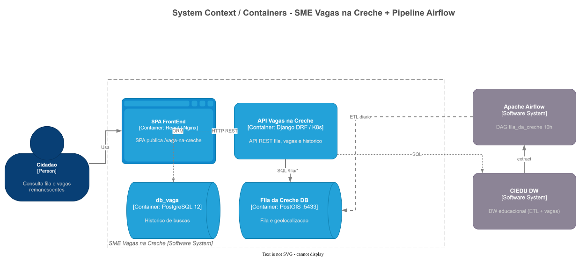
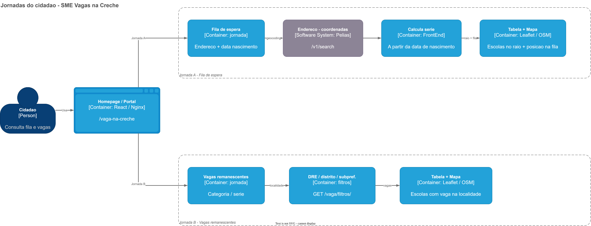

# Visão de Negócio — SME Vagas na Creche

**Produto:** Vagas na Creche (Fila da Creche)  
**Órgão:** Secretaria Municipal de Educação de São Paulo (SME)  
**Data:** Julho/2026  
**Versão:** 1.0  
**Público-alvo:** Product Owner, gestores, stakeholders de negócio e time multidisciplinar  

---

## 1. Propósito deste documento

Consolidar a **visão de negócio** do Vagas na Creche com base na documentação arquitetural do sistema, no levantamento da DAG Airflow (`fila_da_creche`), no glossário e nas recomendações prioritárias.

Documento irmão (visão técnica): [documento-arquitetural-sistema.md](../visao-arquitetural/documento-arquitetural-sistema.md) e [documento-arquitetural-airflow.md](../visao-arquitetural/documento-arquitetural-airflow.md).

---

## 2. Visão do produto

Para **qualquer cidadã(o)** que precisa entender a **demanda e a oferta de vagas em creches** da Rede Municipal de Educação de São Paulo, o **Vagas na Creche** é uma **aplicação web responsiva** que:

- permite consultar a **fila de espera (demanda)** por creches próximas a um endereço informado;
- permite consultar **vagas remanescentes** disponíveis, com filtros por DRE, distrito ou subprefeitura;
- apresenta o resultado em **tabela + mapa interativo** (Leaflet / OpenStreetMap);
- registra, de forma agregada, **histórico de buscas por endereço** (telemetria de uso).

**Diferencial:** ao contrário dos sistemas operacionais de matrícula (ex.: EOL), o portal é de **consulta pública**, em linguagem acessível, **sem cadastro ou login**, focado em transparência da fila e das vagas — não em efetivar matrícula.

---

## 3. Problema que resolve

| Situação anterior | Dor | Solução Vagas na Creche |
|-------------------|-----|-------------------------|
| Informação de fila e vagas dispersa em sistemas internos | Famílias não sabem a demanda perto de casa | Busca por endereço + mapa com escolas e posição na fila |
| Vagas remanescentes pouco visíveis ao cidadão | Dificuldade de localizar unidades com vaga | Filtros por DRE / distrito / subprefeitura + mapa |
| Dados sensíveis de solicitações | Risco de exposição de identificadores | Carga com **anonimização** antes da publicação pública |
| Expectativa de “matricular pelo portal” | Confusão com sistemas de matrícula | Escopo claro: **somente consulta** |

**Contexto de produto:** portal público de transparência da **fila e das vagas em educação infantil (creche)**, alimentado diariamente a partir do CIEDU DW.

---

## 4. Objetivos de negócio

1. Dar **transparência** à demanda (fila de espera) por vagas em creches próximas ao endereço do cidadão.
2. Facilitar a consulta de **vagas remanescentes** por recortes territoriais (DRE, distrito, subprefeitura).
3. Apoiar a **gestão democrática** e a comunicação com famílias, sem exigir conhecimento técnico de bases educacionais.
4. Subsidiar a SME com **telemetria de buscas** (onde as pessoas procuram vagas), sem expor dados pessoais das solicitações.
5. Manter os dados públicos **atualizados diariamente**, com regras de negócio e anonimização aplicadas na carga.

---

## 5. Personas

| Persona | Necessidade principal |
|---------|------------------------|
| **Famílias / responsáveis** | Saber a fila de espera perto de casa e se há vagas remanescentes na região |
| **Cidadã(o) em geral** | Consultar demanda e oferta de creches de forma simples, no mapa |
| **Servidores (SME / DRE)** | Visão pública alinhada aos dados oficiais; apoio à comunicação com a comunidade |
| **Imprensa / pesquisadores** | Transparência sobre fila e vagas na educação infantil municipal |

**Premissa de acesso:** portal **público**, sem cadastro ou login do cidadão.

---

## 6. Escopo do produto

### 6.1 — Em escopo (funcionalidades atuais)

| Capacidade | Descrição de negócio |
|------------|----------------------|
| Consulta de demanda (fila) | Informa endereço e data de nascimento; sistema calcula a série e retorna escolas no raio com posição na fila |
| Geocodificação de endereço | Autocomplete / conversão endereço → coordenadas (Pelias) |
| Mapa interativo | Resultado georreferenciado (Leaflet + OpenStreetMap) |
| Vagas remanescentes | Consulta por série/categoria e localidade (DRE, distrito, subprefeitura) |
| Filtros territoriais | Lista de DREs, distritos e subprefeituras para refinar a busca |
| Histórico de buscas | Registro de pesquisas por endereço (telemetria no banco aplicacional) |
| Preferências no navegador | Persistência local de série, endereço, coordenadas e acessibilidade entre páginas |

### 6.2 — Fora de escopo (por desenho)

- Matrícula, inscrição ou alteração da posição na fila (domínio do EOL / sistemas operacionais)
- Autenticação/cadastro do cidadão
- Edição ou correção de dados cadastrais pela interface pública
- Estatísticas gerais da RME (domínio do **Escola Aberta**)
- Substituição do EOL Gerenciamento como ferramenta operacional interna

### 6.3 — Dependências de dados (visão de negócio)

| Necessidade de negócio | Fonte / ritmo |
|------------------------|---------------|
| Fila de espera, unidades, contatos, vagas georreferenciadas | Banco **Fila da Creche** (PostgreSQL + PostGIS), alimentado pela DAG Airflow `fila_da_creche` |
| Origem consolidada | **CIEDU DW** (a partir de camadas EOL / RAW) |
| Atualização dos números da fila | Carga **diária às 10h** (America/Sao_Paulo), full refresh (truncate + reload) |
| Vagas remanescentes e filtros territoriais | Consulta direta ao **CIEDUDW** pela API |
| Telemetria de buscas | Banco aplicacional **`db_vaga`** (tabela de histórico) |
| Mapa e endereço | OpenStreetMap (tiles) + API Pelias (geocodificação) |

> **Implicação de negócio:** os dados de fila refletem o **último snapshot diário** da DAG (após as 10h, em condições normais), não necessariamente o instante corrente dos sistemas transacionais. Vagas remanescentes consultam o DW em tempo de requisição (com cache apenas nos filtros, TTL 1h).

---

## 7. Jornadas do usuário

### Jornada A — Consulta de demanda (fila de espera)

1. Acessa o portal Vagas na Creche.  
2. Informa **endereço** e **data de nascimento** da criança.  
3. O portal geocodifica o endereço e calcula a **série** de ensino.  
4. Consulta escolas no **raio geográfico** com posição na fila.  
5. Visualiza resultado em **tabela + mapa**.  
6. (Transparente ao usuário) o portal registra a busca no histórico.

### Jornada B — Consulta de vagas remanescentes

1. Acessa o fluxo de **vagas remanescentes**.  
2. Seleciona categoria/série e filtros de localidade (DRE, distrito, subprefeitura).  
3. Obtém escolas com vagas e visualiza em **tabela + mapa**.

> **Observação de produto:** o menu principal ainda aponta para `/vagas-remanescentes` (página de manutenção), enquanto o fluxo funcional está em `/vagas-remanescentes-alternativo` — inconsistência que confunde o cidadão e deve ser unificada.

---

## 8. Roadmap / evolução observada (produto em operação)

| Marco | Entrega de negócio |
|-------|-------------------|
| **Core — Fila** | Consulta pública de demanda por endereço, série e raio, com mapa |
| **Core — Vagas** | Consulta de vagas remanescentes com filtros territoriais |
| **Dados diários** | Publicação via Airflow `fila_da_creche` (11 tasks), com anonimização e geometria das escolas |
| **Telemetria** | Histórico de buscas por endereço no banco aplicacional |
| **Evolução recomendada** | Segurança (SQL parametrizado), estabilidade, cache ampliado, GA4, unificação da rota de vagas remanescentes |

Detalhamento técnico das melhorias: [segurança / recomendações prioritárias](../seguranca/index.md).

---

## 9. Indicadores e uso (evidência operacional)

Fontes disponíveis no levantamento: saúde da DAG Airflow e telemetria de buscas na aplicação. Métricas de borda (Grafana Nginx VTS) e Analytics de jornada SPA ainda são lacunas parciais (UA descontinuado).

| Indicador | Valor / status | Leitura de negócio |
|-----------|----------------|--------------------|
| Execuções bem-sucedidas da DAG | ~31.274 | Pipeline de dados maduro e recorrente |
| Falhas da DAG | ~156 (+ ~854 upstream failed) | Risco pontual de dados desatualizados no portal |
| Duração média da carga | ~1 min 03 s | Publicação diária rápida quando bem-sucedida |
| Últimas 25 runs (maio–jun/2026) | 100% sucesso | Estabilidade recente da carga |
| Telemetria de buscas | Tabela `pesq_historico_busca_endereco` | Permite analisar onde cidadãos buscam vagas |
| Analytics no front | Universal Analytics (descontinuado) | Lacuna para métricas de jornada (rotas SPA) |

**Lacuna de negócio:** migrar para **GA4** com tracking de rotas, para medir conversão homepage → fila / vagas remanescentes e uso real do mapa.

---

## 10. Canais e ambientes

| Ambiente | Namespace / referência |
|----------|------------------------|
| Produção | Namespace K8s `sme-vaganacreche` · path do SPA `/vaga-na-creche` |
| Homologação | `vaganacreche-hom` / `vaganacreche-hom2` |
| Desenvolvimento | `vaganacreche-dev` |
| Registry de imagens | `registry.sme.prefeitura.sp.gov.br` |

URLs de runtime do front (injetadas no container): `API_URL`, `API_ENDERECO` (geocodificação), `URL_VIDEO` (vídeo institucional).

---

## 11. Stakeholders e governança (referência de produto)

| Papel | Responsabilidade típica |
|-------|-------------------------|
| Product Owner | Priorização e visão de negócio |
| Gestão / governança SME | Alinhamento institucional e transparência pública |
| Design / UX | Jornadas de busca, mapa e linguagem clara para famílias |
| Desenvolvimento | Manutenção do portal (FrontEnd + API) |
| Dados / Airflow | Carga diária, qualidade e anonimização dos dados publicados |
| Operação / DevOps | Kubernetes, Jenkins, monitoramento de borda |

Comunidade beneficiada: famílias com crianças em idade de creche, servidores SME/DRE, imprensa e sociedade civil.

---

## 12. Regras e premissas de negócio relevantes

1. **Transparência pública** — informação aberta, sem autenticação do cidadão.  
2. **Somente consulta** — o cidadão não matricula nem altera a fila pelo portal.  
3. **Dados oficiais, não inventados no portal** — o Vagas na Creche **apresenta** consolidados do CIEDU DW / Fila; não é a origem cadastral.  
4. **Atualidade diária (fila)** — expectativa de negócio alinhada à DAG das 10h; falha na carga implica dados do dia anterior.  
5. **Anonimização** — identificadores das solicitações são anonimizados antes da exposição pública.  
6. **Regras de publicação da fila** (DAG): origem cadastro (`tp_origem = 'C'`), status ativo (`st_solicitacao_atual = 'S'`), espera superior a 30 dias, distância máxima de **2 km**.  
7. **Série a partir da data de nascimento** — a jornada de fila depende do cálculo de série no front.  
8. **Privacidade vs. telemetria** — histórico de buscas registra uso do portal (endereço buscado), não dados pessoais das solicitações da fila.  
9. **Separação de domínio** — vagas remanescentes (DW) e fila (banco Fila + PostGIS) são fontes distintas com ritmos diferentes.

---

## 13. Riscos de negócio

| Risco | Impacto no cidadão / instituição | Mitigação sugerida |
|-------|----------------------------------|--------------------|
| Falha ou atraso na carga diária | Fila desatualizada; perda de confiança | Alertas na DAG; validação de volume pós-carga; comunicar data de atualização |
| Full refresh (truncate + reload) sem rollback claro | Janela com dados vazios/incompletos durante a carga | Staging/validação; evolução para carga incremental |
| Indisponibilidade de CIEDUDW ou FilaDB | Portal “sem fila” ou “sem vagas” | Resiliência técnica + mensagens claras de indisponibilidade |
| Rota de vagas remanescentes inconsistente | Percepção de sistema em manutenção | Unificar menu e rota funcional |
| Métricas de uso incompletas (UA) | Decisões de produto sem evidência de jornada | Migrar para GA4 |
| Confusão com EOL / Escola Aberta | Expectativa de matricular ou ver estatísticas da RME | Comunicação clara do escopo na interface |
| Abuso da API pública | Degradação do serviço em picos / scraping | Rate limiting e endurecimento de segurança (sem mudar o caráter público) |

---

## 14. Oportunidades de evolução (visão produto)

| Horizonte | Oportunidade de negócio |
|-----------|-------------------------|
| Curto | Explicitar **data de atualização** da fila; corrigir rota de vagas remanescentes; mensagens amigáveis em falha parcial |
| Médio | Métricas de jornada (GA4); melhor tempo de resposta percebido (cache/pooling) sem mudar o valor de negócio; alertas de qualidade dos dados |
| Longo | Carga incremental / maior frescor dos dados; novos recortes oficiais mantendo linguagem simples e mapa |

Detalhamentos técnicos: [segurança / recomendações prioritárias](../seguranca/index.md) e [documentação do Airflow](../visao-arquitetural/documento-arquitetural-airflow.md).

---

## 15. Critérios de sucesso (negócio)

- Família encontra creches por **endereço** e entende a **fila** sem conhecimento técnico.  
- Cidadão localiza **vagas remanescentes** por recorte territorial com mapa legível.  
- Portal permanece **público e utilizável** em desktop e mobile.  
- Dados exibidos são **rastreáveis a fontes oficiais**, com **atualização diária** da fila e **anonimização** respeitada.  
- Uso efetivo mensurável (buscas registradas; futuramente jornadas GA4: fila vs. vagas remanescentes).

---

## 16. Glossário rápido de negócio

| Termo | Significado |
|-------|-------------|
| **SME** | Secretaria Municipal de Educação de São Paulo |
| **DRE** | Diretoria Regional de Educação |
| **Fila de espera / Demanda** | Solicitações ativas de matrícula em creche, publicadas de forma anonimizada |
| **Vagas remanescentes** | Vagas ainda disponíveis para consulta pública, por série e localidade |
| **CIEDU DW / CIEDUDW** | Data Warehouse educacional — origem dos dados consolidados |
| **EOL** | Escola Online / ecossistema de gestão educacional da SME (origem operacional) |
| **DAG `fila_da_creche`** | Pipeline Airflow diário que publica os dados da fila no banco do portal |
| **PostGIS / raio** | Consulta espacial de escolas próximas ao endereço (ex.: até 2 km nas regras de carga) |
| **db_vaga** | Banco aplicacional do portal (telemetria de buscas) |
| **Escola Aberta** | Portal irmão de transparência da RME (estatísticas); domínio distinto deste produto |

---

## 17. Referências

| Fonte | Uso neste documento |
|-------|---------------------|
| [documento-arquitetural-sistema.md](../visao-arquitetural/documento-arquitetural-sistema.md) | Visão do produto, jornadas, escopo funcional, ambientes |
| [documento-arquitetural-airflow.md](../visao-arquitetural/documento-arquitetural-airflow.md) | Objetivo de negócio da carga, regras, ritmo diário, riscos de dados |
| [Documento_Arquitetural_Fila_da_Creche.md](../../Levantamento/Documento_Arquitetural_Fila_da_Creche.md) | Levantamento operacional da DAG |
| [seguranca/index.md](../seguranca/index.md) | Oportunidades e riscos de produto/experiência |
| [GLOSSARIO_E_EXPLICACOES_VagasNaCreche.md](../../Documentos/GLOSSARIO_E_EXPLICACOES_VagasNaCreche.md) | Termos e premissas de comunicação com stakeholders |
| [sistema-vaganacreche](../../diagramas/drawio/sistema-vaganacreche/01-arquitetura-geral.drawio) e [fila-da-creche](../../diagramas/drawio/fila-da-creche/01-arquitetura-logica.drawio) | Fluxos de fila, vagas e publicação de dados |

---

*Documento de visão de negócio — SME Vagas na Creche — Julho/2026.*
